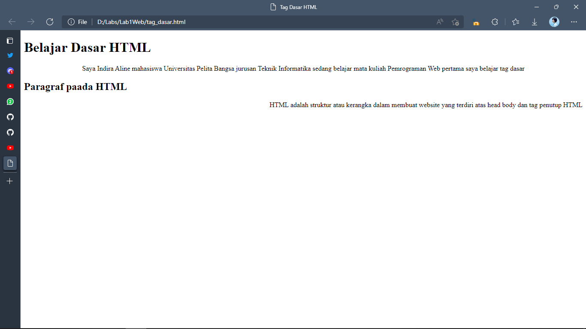
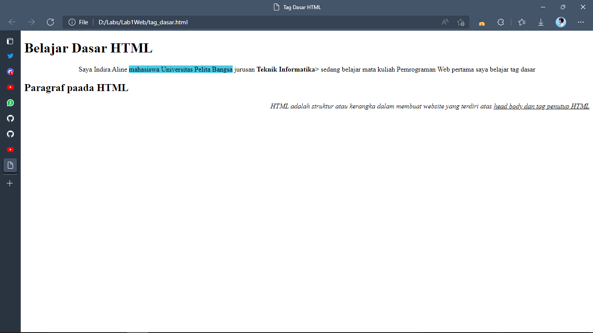
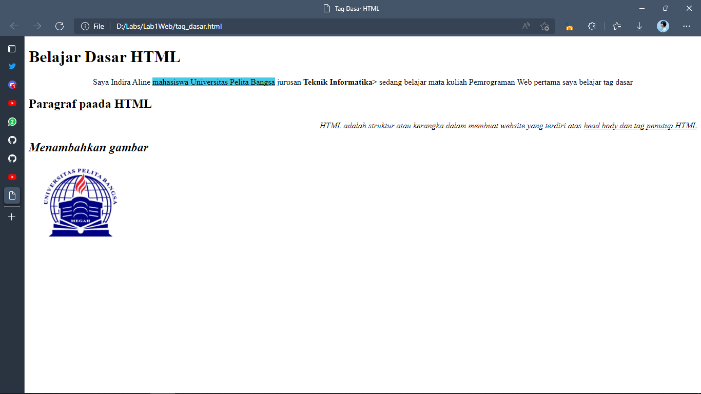
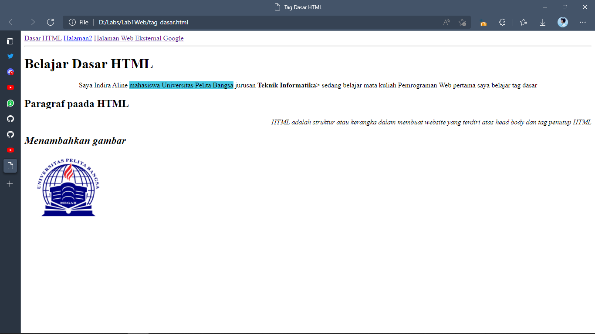

# Lab1Web

| Indira Aline | 312010042 |
| -------------- | --------- |
| TI.20 A.1      | Pemrograman Web |

## Paragraf


Berikut hasil dari tag <p>

### contoh codingan
```html
<!DOCTYPE html>
<html lang="en">
<head>
    <meta charset="UTF-8">
    <meta http-equiv="X-UA-Compatible" content="IE=edge">
    <meta name="viewport" content="width=device-width, initial-scale=1.0">
    <title>Tag Dasar HTML</title>
</head>
<body>
    <!-- paragraf pertama -->
    <p align="center" >Saya Indira Aline mahasiswa Universitas Pelita Bangsa jurusan Teknik Informatika sedang belajar mata kuliah Pemrograman Web pertama saya belajar tag dasar</p>
    <!-- paragraf kedua -->
    <p align="right" >HTML adalah struktur atau kerangka dalam membuat website yang terdiri atas head body dan tag penutup HTML</p>
</body>
</html>
```

## Heading


Berikut contoh heading, heading adalah sebagai judul dari sebuah artikel web. (h1) adalah heading terbesar (h6) adalah heading terkecil.

## contoh coding
```html
<!DOCTYPE html>
<html lang="en">
<head>
    <meta charset="UTF-8">
    <meta http-equiv="X-UA-Compatible" content="IE=edge">
    <meta name="viewport" content="width=device-width, initial-scale=1.0">
    <title>Tag Dasar HTML</title>
</head>
<body>
    <!-- judul paragraf pertama -->
    <h1>Belajar Dasar HTML</h1>
    <!-- paragraf pertama -->
    <p align="center" >Saya Indira Aline mahasiswa Universitas Pelita Bangsa jurusan Teknik Informatika sedang belajar mata kuliah Pemrograman Web pertama saya belajar tag dasar</p>
    <!-- judul paragraf kedua -->
    <h2>Paragraf Pada HTML</h2>
    <p align="right" >HTML adalah struktur atau kerangka dalam membuat website yang terdiri atas head body dan tag penutup HTML</p>
</body>
</html>
```

## Teks Format


Contoh dari teks format seperti menambahkan (span) untuk warna teks atau background-color teks, sementara untuk bold memiliki code (b) untuk cetak tebal, dan untuk teks miring yaitu memiliki code (i) dan garis bawah yaitu (u)

## contoh coding
```html
<!DOCTYPE html>
<html lang="en">
<head>
    <meta charset="UTF-8">
    <meta http-equiv="X-UA-Compatible" content="IE=edge">
    <meta name="viewport" content="width=device-width, initial-scale=1.0">
    <title>Tag Dasar HTML</title>
</head>
<body>
    <!-- judul paragraf pertama -->
    <h1>Belajar Dasar HTML</h1>
    <!-- paragraf pertama -->
    <p align="center" > Saya Indira Aline <span style="background-color: #48cae4;">mahasiswa Universitas Pelita Bangsa</span> jurusan <b>Teknik Informatika</b>> sedang belajar mata kuliah Pemrograman Web pertama saya belajar tag dasar</p>
    <!-- judul paragraf kedua -->
    <h2>Paragraf Pada HTML</h2>
    <p align="right"><i>HTML adalah struktur<i> atau kerangka dalam membuat website yang terdiri atas <u>head body dan tag penutup HTML</u></p>
</body>
</html>
```

## Mnambahkan Gambar


Berikut adalah tag bagaimana menambahkan foto ke dalam HTML yaitu dengan menggunakan tag (img) kemudian simpan file source difolder yang sudah dibuat sebelumnya

## contoh coding
```html
<!DOCTYPE html>
<html lang="en">

<head>
    <meta charset="UTF-8">
    <meta http-equiv="X-UA-Compatible" content="IE=edge">
    <meta name="viewport" content="width=device-width, initial-scale=1.0">
    <title>Tag Dasar HTML</title>
</head>

<body>
    <!-- judul paragraf pertama -->
    <h1>Belajar Dasar HTML</h1>
    <!-- paragraf pertama -->
    <p align="center"> Saya Indira Aline <span style="background-color: greenyellow;">mahasiswa Universitas Pelita</span>
        Bangsa jurusan <b>Teknik Informatika</b>> sedang belajar mata kuliah Pemrograman Web pertama saya belajar tag
        dasar</p>

    <!-- judul paragraf kedua -->
    <h2>Paragraf Pada HTML</h2>
    <p align="right"><i>HTML adalah struktur<i> atau kerangka dalam membuat website yang terdiri atas <u>head body dan tag penutup HTML</u></p>

    <!-- sub judul gambar -->
    <h2>Menambahkan gambar</h2>
    <!-- Menambahkan gambar pada dokumen -->
    

</body>
</html>
```

## Menambahkan Link


Tag link menggunakan tag navigasi dimana tag tersebut seoerti (a herf) link ini akan menuju internal atau eksternal

## contoh coding
```html
<!DOCTYPE html>
<html lang="en">

<head>
    <meta charset="UTF-8">
    <meta http-equiv="X-UA-Compatible" content="IE=edge">
    <meta name="viewport" content="width=device-width, initial-scale=1.0">
    <title>Tag Dasar HTML</title>
</head>

<body>
    <!-- menambahkan navigasi -->
    <nav>
        <a href="tag_dasar.html">Dasar HTML</a>
        <a href="halaman2.html">Halaman2</a>
        <a href="https://www.youtube.com/watch?v=z3m8QLCxCl0">Halaman Web Eksternal Google</a>
    </nav>
    <hr>
    <!-- judul paragraf pertama -->
    <h1>Belajar Dasar HTML</h1>
    <!-- paragraf pertama -->
    <p align="center"> Saya adala Indira Aline <span style="background-color: greenyellow;">mahasiswa Universitas Pelita</span>
        Bangsa jurusan <b>Teknik Informatika</b>> sedang belajar mata kuliah Pemrograman Web pertama saya belajar tag
        dasar</p>

    <!-- judul paragraf kedua -->
    <h2>Paragraf Pada HTML</h2>
    <p align="right"><i>HTML adalah struktur<i> atau kerangka dalam membuat website yang terdiri atas <u>head body dan tag penutup HTML</u></p>

    <!-- sub judul gambar -->
    <h2>Menambahkan gambar</h2>
    <!-- Menambahkan gambar pada dokumen -->
    

</body>
</html>
```