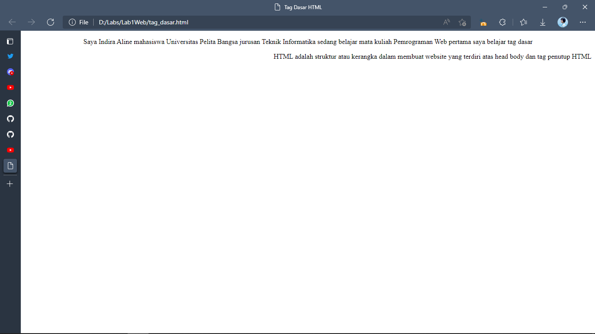

# Lab1Web

| Indira Aline | 312010042 |
| -------------- | --------- |
| TI.20 A.1      | Pemrograman Web |

## Paragraf


Berikut hasil dari tag <p>

### contoh codingan
```html
<!DOCTYPE html>
<html lang="en">
<head>
    <meta charset="UTF-8">
    <meta http-equiv="X-UA-Compatible" content="IE=edge">
    <meta name="viewport" content="width=device-width, initial-scale=1.0">
    <title>Tag Dasar HTML</title>
</head>
<body>
    <!-- paragraf pertama -->
    <p align="center" >Saya Indira Aline mahasiswa Universitas Pelita Bangsa jurusan Teknik Informatika sedang belajar mata kuliah Pemrograman Web pertama saya belajar tag dasar</p>
    <!-- paragraf kedua -->
    <p align="right" >HTML adalah struktur atau kerangka dalam membuat website yang terdiri atas head body dan tag penutup HTML</p>
</body>
</html>
```